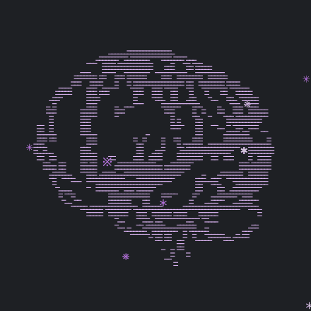
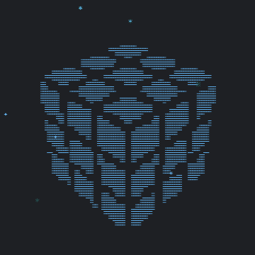

# ASCII Art Animator

> Transform images and GIFs into stunning animated ASCII art

[한국어](README.ko.md)

<table>
  <tr>
    <td></td>
    <td></td>
  </tr>
</table>

## ✨ Features

- **Image to ASCII Conversion**: Convert static images into ASCII art with customizable character mapping
- **Animated GIF Support**: Transform GIFs into frame-by-frame ASCII animations
- **Advanced Image Preprocessing**:
  - Gamma correction
  - Black/White point adjustment
  - Blur, grain, and noise effects
  - Floyd-Steinberg dithering for smooth gradients
  - Color inversion
- **Brightness Mapping**: Rich ASCII art with multiple brightness levels
- **Export Options**:
  - PNG (single frame)
  - GIF (animated)
  - WebM (video)
  - React/HTML code (standalone)
- **Real-time Preview**: 60 FPS canvas-based rendering
- **Fully Customizable**: Control every aspect of the ASCII art generation

## 🚀 Quick Start

```bash
git clone https://github.com/yukgong/ascii-art-animator.git
cd ascii-art-animator
npm install
npm run dev
```

Open [http://localhost:3000](http://localhost:3000) to see the app.

## 🎨 Usage

1. **Upload an Image or GIF**: Click "Upload Media" to select a file
2. **Adjust Settings**: Fine-tune preprocessing, character mapping, colors, and more
3. **Play Animation**: Click play to see your ASCII art come to life
4. **Export**: Save as PNG, GIF, WebM, or download the React component code

## 🛠️ Tech Stack

- **Framework**: Next.js 15 (App Router)
- **Runtime**: React 19
- **Rendering**: Canvas API
- **Image Processing**: Custom algorithms (gamma, dithering, preprocessing)
- **GIF Generation**: [gif.js](https://github.com/jnordberg/gif.js)
- **GIF Parsing**: [gifuct-js](https://github.com/matt-way/gifuct-js)
- **File Handling**: JSZip, FileSaver.js
- **Styling**: Tailwind CSS

## 📦 Project Structure

```
ascii-art-animator/
├── app/
│   ├── layout.tsx              # Root layout
│   ├── page.tsx                # Main editor page
│   └── globals.css             # Global styles
├── components/
│   └── animator/
│       ├── AsciiCanvas.tsx     # Canvas-based ASCII renderer
│       └── AsciiControlPanel.tsx # Settings panel
├── lib/
│   └── animations/
│       └── ascii-engine.ts     # Core ASCII art engine
├── types/
│   └── gifuct-js.d.ts          # GIF library types
└── public/
    └── gif.worker.js           # GIF generation worker
```

## 🎯 Core Algorithm

1. **Image Preprocessing**: Apply gamma, blur, grain, dithering, and color adjustments
2. **Brightness Extraction**: Convert each pixel to brightness value (0-255)
3. **Character Mapping**: Map brightness to ASCII characters based on threshold levels
4. **Rendering**: Draw ASCII art on canvas at 60 FPS

## 🤝 Contributing

Contributions are welcome! Please feel free to submit a Pull Request.

1. Fork the repository
2. Create your feature branch (`git checkout -b feature/amazing-feature`)
3. Commit your changes (`git commit -m 'Add some amazing feature'`)
4. Push to the branch (`git push origin feature/amazing-feature`)
5. Open a Pull Request

## 📄 License

MIT License — see the [LICENSE](LICENSE) file for details.
